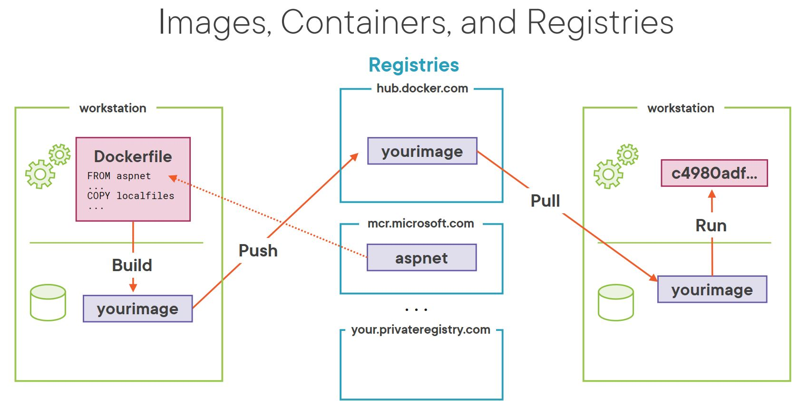
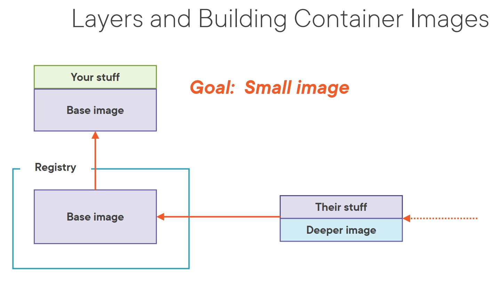
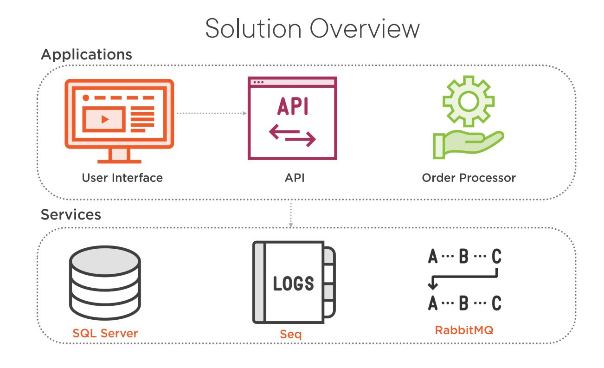

# Developing .NET Core 5 Apps with Docker

This course is about developing .NET Core 5 apps with Docker.

## Getting Started with .NET Core and Docker

Basic introduction to .NET Core and Docker.

It is pretty easy to add Docker support to a .NET Core project, especially if you use Visual Studio or VS Code (remember to use extensions).

## Logging in Docker-based .NET Core Apps

Logging in containers:

- key success factor: enable understanding and ease-of-use, then get on with app,
- console is key: troubleshooting is made easy by console logging,
- analysis matters: get logs into a store that supports analysis and exploration.

Level up with Serilog:

- logging libraries provide benefits:
  - structured logging,
  - wide variety of "sinks" (targets),
  - enrichers (add context to log events),
  - filters (control what gets logged),
- Serilog is leading the pack:
  - NLog and Log4Net are also popular.

## Configuration in Docker-based .NET Core Apps

Types of configuration:

- environment-specific: URLs, server names, non-secret values,
- secrets: passwords, API keys, connection strings, license keys, etc.,
- runtime "knobs": things you don't want hard-coded (feature toggles?) - very subjective.

Layered configuration:

- appsettings.json: json-based text file,
- appsettings.{environment}.json: json-based text file, based on ASPNETCORE_ENVIRONMENT,
- user secrets: development only, not checked into source control,
- environment variables: set by the OS, can be set in Dockerfile,
- command-line arguments: set by the OS, can be set in Dockerfile.

Containers like environment variables: containers are immutable - build one image to run anywhere.

Typical approach:

- app settings with environment variables,
- eliminates env-specific appsettings files,
- leverage container capabilities,
- load secrets during runtime if needed.

Protect your secrets:

- different approaches are available,
- apply as environment variables from secrets in pipeline,
  - consider who can see variables,
- read at runtime from a vault:
  - you still need to auth to the vault.

## Building Docker Images for .NET Core Apps

Process:

- set up base image with aspnetcore runtime,
- use full sdk as build stage,
- restore packages and build project,
- alias build as publish and run dotnet publish,
- copy publish files into final image with just the runtime on it.

## Simplify Complex Solutions with Docker Compose

Docker Compose:

- container orchestration tool,
- "define and share multi-container apps",
- simplify what we need to keep track of,
- developer set-up (and tear-down) is easy!

Traditional setup vs. Docker Compose.

| Traditional                             | Docker Compose                   |
| --------------------------------------- | -------------------------------- |
| Get source code                         | Get source code                  |
| Find way to run Seq                     | Run solution (docker-compose up) |
| Find way to run SQL Server              | -                                |
| Run database setup/initial data scripts | -                                |
| Find way to run RabbitMQ                | -                                |
| Verify connection strings               | -                                |
| Verify website setup                    | -                                |
| Run solution (set startup projects)     | -                                |

SQL in Docker Compose:

- startup is a challenge,
- wait for it to be started and listening then run setup logic,
- use custom Dockerfile and entrypoint logic.

Sample App (Carved Rock) Architecture

Now you are ready to start developing .NET Core 5 apps with Docker :-).
